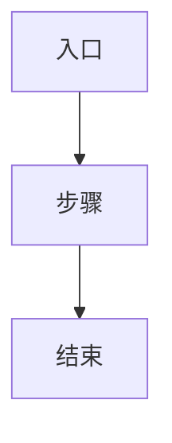

# Change Record 模板

> **使用方式**:复制本文件到 `CR-<YYYY-MM-DD>-<feature-name>/` 目录下,按需拆分为独立文件(`spec.md` / `design.md` / `tasks.md` / `decisions.md` / `test-plan.md` / `rollback.md` / `trace.md`),或保留单文件形式。
>
> **必填字段** ✅;**可选字段** 📌,视需求复杂度裁剪。

---

## spec.md — 需求规格 ✅

### 基本信息

| 字段      | 内容                       |
| --------- | -------------------------- |
| CR ID     | CR-YYYY-MM-DD-feature-name |
| 需求名称  |                            |
| 提出方    |                            |
| 启动日期  |                            |
| feat 分支 | feat-feature-name          |
| 归档路径  | 路径 B(手动 CR)            |

### 需求背景

<!-- 为什么要做这个需求?业务场景 / 用户痛点 / 上下游依赖 -->

### 目标(Goals)

- [ ] 目标 1
- [ ] 目标 2

### 非目标(Non-Goals)

明确本次**不做**什么,避免范围蔓延:

- 不做 X
- 不做 Y

### 影响范围

- **代码模块**:如 `cmd/` / `internal/client/` / `internal/agentbay/`
- **对外接口**:命令行语义变化 / 输出格式变化
- **数据**:是否涉及用户数据 / 配置迁移
- **兼容性**:向前 / 向后兼容说明

---

## design.md — 技术设计 📌

### 架构改动

<!-- 新增 / 修改了哪些模块,模块间依赖关系 -->

### 接口契约

- **新增接口**:Action / Version / 入参 / 返回
- **修改接口**:差异说明 / 兼容策略

### 核心流程



### 状态机(如有)


### 错误处理

| 场景         | 行为                     | 退出码 |
| ------------ | ------------------------ | ------ |
| 认证失败     | 打印 ErrNotAuthenticated | 1      |
| 参数校验失败 | 打印 usage               | 1      |

---

## tasks.md — 任务分解 📌

建议与 `todo_write` 的 tasklist 保持同步映射。

| Task ID | 内容 | 状态    | 对应 commit |
| ------- | ---- | ------- | ----------- |
| T1      |      | PENDING |             |
| T2      |      | PENDING |             |

---

## decisions.md — 关键决策记录 📌

逐条记录重要决策,包含**背景 / 选项 / 结论 / 理由**:

### D1. 决策主题

- **选项**:
  - A. 选项 A(描述)
  - B. 选项 B(描述)
- **结论**:选 X
- **理由**:
- **决策人 / 决策日期**:

### D2. 决策主题

...

---

## test-plan.md — 测试计划 📌

### 单元测试

- [ ] 文件 `test/unit/.../xxx_test.go`:覆盖点

### 集成测试

- [ ] 场景 1:

### 回归测试

- [ ] 相关功能 A 不受影响
- [ ] 相关功能 B 不受影响

### 验证命令

```bash
go build ./...
go test ./... -count=1
```

---

## rollback.md — 回滚预案 📌

### 回滚触发条件

- 线上发现 P1/P2 问题
- 兼容性问题

### 回滚步骤

1. revert 相关 commit:`git revert <sha>`
2. 重新发布
3. 通知相关方

### 数据修复(如有)

---

## trace.md — 追溯链 ✅

**持续更新本章节**,每个关键节点完成后追加一条记录。

### 分支信息

| 项          | 值                         |
| ----------- | -------------------------- |
| feat 分支   | feat-feature-name          |
| 起始 commit | (from aliyun/master @ SHA) |
| 建立时间    |                            |

### Commit 记录

| 时间 | Commit SHA | Type | 摘要 |
| ---- | ---------- | ---- | ---- |
|      |            | feat |      |
|      |            | test |      |
|      |            | docs |      |

### Push 记录

| 时间 | 目标 Remote | 分支              | 触发 CI |
| ---- | ----------- | ----------------- | ------- |
|      | origin      | feat-feature-name | 是 / 否 |
|      | aliyun      | feat-feature-name | 是 / 否 |

### PR 记录

| 项          | 值  |
| ----------- | --- |
| PR 链接     |     |
| 审批人      |     |
| 合并时间    |     |
| 合并 Commit |     |

### 发布记录

| 项            | 值  |
| ------------- | --- |
| Release Tag   |     |
| 发布时间      |     |
| Homebrew 版本 |     |

### 关联档案

- Quest Spec(若混用路径 A):`.qoder/quest/<quest-id>/`
- 外部文档 / 钉钉需求卡片 / Jira:
